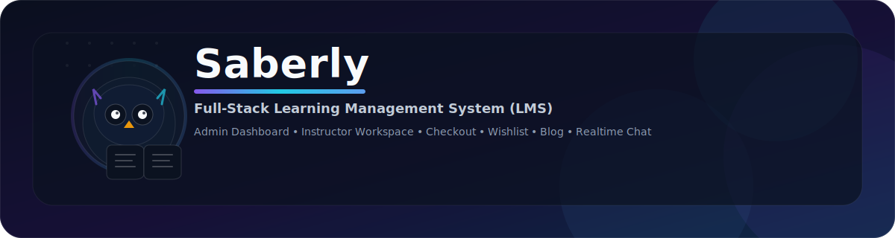

<p align="center">
  
</p>

# Saberly — LMS Full Stack (Udemy-like) em Laravel

Saberly é uma plataforma **LMS (Learning Management System)** completa, construída com foco em práticas reais de mercado: páginas públicas ricas em conteúdo, **catálogo de cursos**, experiência de compra com **carrinho e wishlist via AJAX**, **checkout com gateway de pagamento**, automações de e-mail e **painéis dedicados para Admin e Instrutor**. O projeto foi estruturado para manter **coerência de domínio**, **separação de responsabilidades** e **evolução segura** do código, sem “gambiarras” típicas de projetos tutorializados.

---

## Visão geral do produto

O sistema é composto por três grandes superfícies de uso:

**1) Frontend público (site / vitrine)**  
A vitrine é totalmente dinâmica: exibe categorias e subcategorias, seções de destaque, sliders promocionais (com vídeo), blocos informativos com ícones SVG, cursos mais vendidos, feedbacks de alunos, parceiros, blog, FAQ e páginas institucionais. Tudo é gerenciável pelo painel administrativo, reduzindo hardcode e mantendo consistência editorial.

**2) Backoffice administrativo (Admin Dashboard)**  
O Admin controla o “cérebro” do produto: configurações globais do site (logo, favicon, meta title/description, contatos, redes sociais, copyright), slider, info boxes, parceiros, reviews (ativar/inativar), blog (posts, tags, categorias, arquivos), além de áreas de operação relacionadas a assinantes/newsletter e disparos promocionais.

**3) Painel do instrutor (Instructor Dashboard)**  
O instrutor tem uma visão operacional do que realmente importa: total de pedidos, ganhos, estudantes, cursos e relatórios (incluindo gráficos). Além disso, gerencia cursos (com seções), cupons, pedidos, perguntas e respostas, avaliações e **chat em tempo real** com estudantes (via broadcasting).

---

## Funcionalidades implementadas (o que está pronto no Saberly)

### Catálogo e navegação
- **Categorias e Subcategorias** com listagens dinâmicas.
- Página “All Courses” com **sistema de filtros avançado** combinável (ex.: nível + instrutor + categoria), refletido em **parâmetros de URL** e consumido via chamadas assíncronas (AJAX) — abordagem profissional para manter navegabilidade, compartilhamento de links e previsibilidade de estado.
- Cards de curso com interações (tooltips / preview), navegação rápida e experiência fluida.

### Carrinho e wishlist (AJAX, sem dependência de pacote)
- **Carrinho** com adição/remoção e atualização dinâmica.
- Persistência do carrinho por **cookie** (permitindo uso **sem login**), preservando intenção de compra e reduzindo atrito.
- **Wishlist** por usuário autenticado, com inclusão/remoção via AJAX e listagem dedicada.
- Checkout com resumo de itens e limpeza/atualização consistente do estado do carrinho.

### Página de detalhes do curso
- Preview de vídeo com reprodução imediata.
- Estrutura informativa: pré-requisitos, requisitos, descrição, duração, seção “alunos também compraram”.
- Bloco do instrutor com visibilidade de cursos publicados e contexto de autoria.
- Reviews exibidas conforme política de publicação (ex.: ativa/inativa no Admin).

### Autenticação e identidade
- Registro e login de usuários.
- Integração opcional com **Google OAuth**.
- Separação de experiência por papel: Admin / Instrutor / Estudante.

### Pagamentos e e-mails transacionais
- Checkout com **Stripe** e suporte a múltiplos gateways (configurável por settings).
- Confirmação de compra por e-mail (transacional), com dados do pedido/curso.
- Integração com SMTP configurável pelo painel.

### Newsletter, assinantes e campanhas
- Área de **Subscribe** para captura de e-mails.
- Painel para gestão de assinantes.
- Disparo de e-mails promocionais/campanhas (ex.: alertas de novos cursos), com template dedicado.

### CMS de Blog
- Listagem e detalhe de post com sidebar (categorias, arquivos, recentes).
- Filtro por categoria e tags.
- Gestão de tags no backoffice com manipulação consistente (incluindo arrays de tags por post).

### Conteúdo dinâmico e governança do site
- Slider gerenciável (título, descrição, vídeo promo, link com “copy” para compartilhamento).
- Info boxes com **ícones SVG**, título e descrição.
- Seções institucionais (About, Contact, FAQ etc.) e links sociais controláveis por settings.
- Parceiros e feedbacks controlados pelo Admin (habilitar/desabilitar para aparecer no front).

### Chat em tempo real (Instrutor ↔ Estudante)
- Canal de mensagens para alunos que compraram o curso.
- Atualização em tempo real via broadcasting (ex.: Pusher).
- Observação importante de arquitetura: em ambientes gratuitos/limites de tráfego, duplicidade de eventos pode ocorrer se não houver deduplicação/ack; o sistema foi desenhado para suportar consistência eventual de UI.

---

## Arquitetura (como o Saberly foi organizado)

### Estratégia de camadas e responsabilidade
O projeto segue a filosofia do Laravel, mas evita controllers “gordos”. A regra aqui é simples:

- **Controller** coordena a requisição (validação, autorização, resposta).
- **Domain/Services** concentram regras de negócio (ex.: “publicar review”, “gerar checkout”, “aplicar cupom”, “montar filtros”).
- **Models + Repositories/Queries** tratam acesso a dados e composição de consultas (especialmente para filtros avançados).
- **Jobs/Events/Listeners** são usados para tarefas assíncronas e efeitos colaterais (e-mails, broadcast, logs, etc.).

O resultado é previsibilidade: cada regra tem um “lugar certo” e o sistema escala sem virar um bloco único difícil de manter.

### Fronteira de domínios (bounded context pragmático)
Na prática, o Saberly se organiza em módulos claros:

- **Catálogo**: Category, Subcategory, Course, Section/Lesson.
- **Comércio**: Cart, Checkout, Order, Payment, Coupon.
- **Engajamento**: Wishlist, Review, Q&A, Chat.
- **Conteúdo/Marketing**: Slider, InfoBox, Partner, Blog, Subscriber/Newsletter.
- **Plataforma**: Users, Roles, Settings (site/app settings), Auth, OAuth.

Essa divisão reduz acoplamento e impede que “Blog” comece a invadir “Checkout” (problema comum em LMS grandes).

### RBAC e governança
O controle de acesso é definido por papéis (Admin/Instrutor/Estudante), garantindo:
- Rotas administrativas isoladas.
- Rotas e ações do instrutor protegidas.
- Operações de estudante restritas ao que foi comprado (ex.: acesso ao curso, chat, etc.).

### Settings dinâmicos (Admin controla o comportamento do site)
O painel de configurações centraliza variáveis operacionais:
- SMTP
- chaves de pagamento (Stripe)
- credenciais do Google OAuth
- identidade do site (logo/favicon/meta)

Arquiteturalmente, isso reduz dependência de edição manual de `.env` e traz governança para o produto. Quando necessário, as configurações são persistidas em storage confiável (banco) e consumidas de forma consistente pelo runtime.

---

## Stack e principais tecnologias

O Saberly foi construído em **Laravel (Blade + Vite)** com uma abordagem moderna de front dinâmico via **AJAX**:

- **Backend**: Laravel (rotas web, controllers, validação, políticas), Eloquent ORM, migrations/seeders
- **Frontend**: Blade + Tailwind (layout e UI), Vite para build, interações assíncronas via AJAX (ex.: Axios/jQuery)
- **Banco**: PostgreSQL ou MySQL (configurável)
- **Pagamentos**: Stripe (e possibilidade de segundo gateway por configuração)
- **E-mail**: SMTP configurável (Mailtrap recomendado em dev)
- **Tempo real**: Broadcasting (ex.: Pusher)

> Observação técnica: o projeto foi desenhado para manter compatibilidade com diferentes bancos, evitando suposições implícitas de tipo/serialização (ponto crítico quando se alterna entre MySQL e PostgreSQL).

---

## Instalação local (desenvolvimento)

### Requisitos
- PHP (recomendado 8.2+)
- Composer
- Node.js + NPM
- Banco (PostgreSQL ou MySQL)
- Extensões PHP típicas do Laravel (openssl, pdo, mbstring, tokenizer, xml, ctype, json, fileinfo)

### Passo a passo
Clone o repositório e instale dependências:

```bash
composer install
npm install
````

Crie o `.env`:

```bash
cp .env.example .env
php artisan key:generate
```

Configure o banco no `.env`:

```env
DB_CONNECTION=pgsql
DB_HOST=127.0.0.1
DB_PORT=5432
DB_DATABASE=saberly
DB_USERNAME=postgres
DB_PASSWORD=secret
```

Rode migrations e seeders:

```bash
php artisan migrate --seed
```

Suba os assets:

```bash
npm run dev
```

Suba a aplicação:

```bash
php artisan serve
```

---

## Estrutura de rotas (visão de alto nível)

O Saberly mantém rotas separadas por contexto:

* Rotas públicas: home, catálogo, detalhe do curso, blog, páginas institucionais
* Rotas de autenticação: login, register, social auth
* Rotas de estudante: dashboard do usuário, cursos comprados, wishlist, chat
* Rotas do instrutor: dashboard, cursos, cupons, pedidos, Q&A, reviews
* Rotas administrativas: dashboard, categorias, subcategorias, settings, sliders, info boxes, parceiros, reviews, blog, subscribers/campaigns

Essa separação melhora segurança e legibilidade: cada camada “vê” somente o que precisa ver.

---

## Observabilidade e confiabilidade (o que foi levado a sério)

Em projetos LMS, problemas comuns são inconsistência de estado (carrinho/wishlist), falhas silenciosas de pagamento e e-mail, e filtros “quebrando” SEO/URL. O Saberly endereça isso com:

* **Estado do carrinho por cookie** (experiência sem login + persistência estável)
* **Operações AJAX idempotentes** (remoção/adição repetida não corrompe estado)
* **Parâmetros de URL como fonte de verdade** no filtro avançado (compartilhável, debuggável)
* **Settings centralizados** para reduzir drift de configuração
* **Broadcasting** com estratégia que tolera duplicidade eventual em ambientes limitados

---

## Segurança

* Proteção de rotas por autenticação e papéis (RBAC).
* CSRF ativo em formulários e requests web.
* Validações server-side para entradas críticas (cadastros, checkout, settings).
* Separação clara entre páginas públicas e backoffice.

---

## Licença e uso

Este repositório é destinado a estudo/uso como base de LMS e portfólio. Caso exista licença específica no projeto, ela deve prevalecer sobre esta seção.
